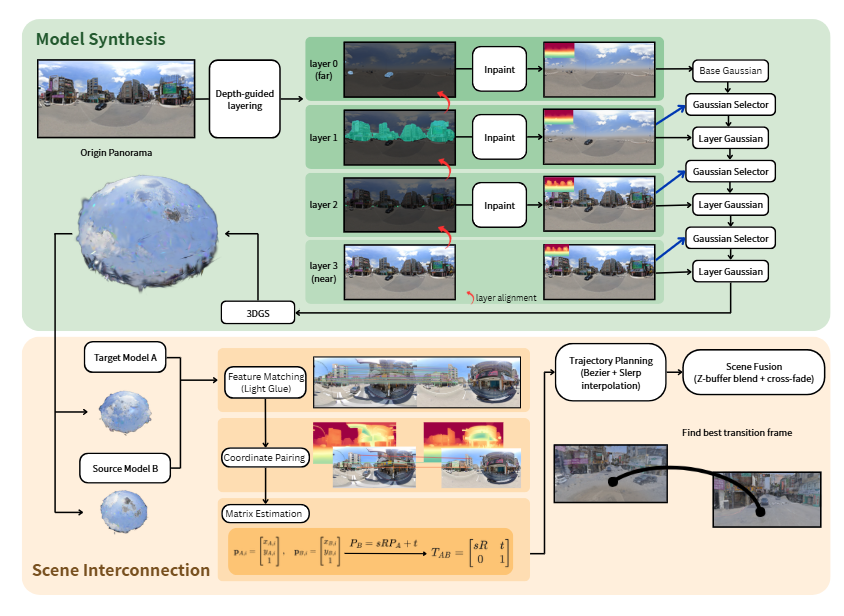

# CityLayer: Immersive Street Roaming via Layered 3D Gaussian Splatting

Build layered 3D Gaussian Splatting scenes from a pair of 360° street panoramas.



## Data

Create a folder under `data/` and put two panoramas named like [`examples/inputs/`](examples/inputs/):

```text
data/<scene_name>/
  input_a.png
  input_b.png
```

Use equirectangular 360° images (2:1 recommended, e.g. `2048×1024`). Details: [`data/README.md`](data/README.md).

Demo pair: `examples/inputs/input_a.png`, `examples/inputs/input_b.png`. Demo videos: `examples/outputs/`.

## Run

Requires the LayerPano3D environment and a GPU.

```bash
bash scripts/run.sh <scene_name> [scene_type]
```

`scene_type` defaults to `outdoor`. This builds both scenes, then aligns them and renders a transition:

```text
outputs/<scene_name>/
  model_a/    # from input_a.png
  model_b/    # from input_b.png
  align/transition_video.mp4
```

```bash
bash scripts/run.sh demo
```

PLY files are in `outputs/<scene_name>/model_{a,b}/scene/`.

To rerun only alignment + video:

```bash
bash scripts/run_transition.sh demo
```

Optional files in `data/<scene_name>/`: `gps.json`, `mask_a.png`, `mask_b.png`. See [`data/README.md`](data/README.md).
